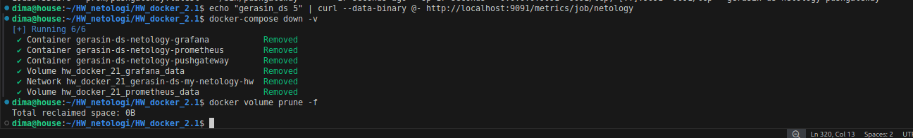

# HW_docker_2

# Gerasin Dmitrii Sergeevitsh

## Домашняя работа к занятию Docker 2 лекция.

---


### Задание 1

**Напишите ответ в свободной форме, не больше одного абзаца текста.**

Установите Docker Compose и опишите, для чего он нужен и как может улучшить лично вашу жизнь.


---

Docker и Docker compose установил, он нужен для запуска много контейнерных приложений,
 упрощает процедуру запуска и управления контейнерами, сейчас я не работаю в сфере 
 но даже выполняя домашние задания я вижу что управление контейнерами, даже запуск одного контейнера 
 проще и легче искользуя Docker compose, нежели использовать команды Docker.
 Поэтому я хочу досконально разобраться и освоить данную технологию, уверен мне эти навыки пригодятся.

 ---


 ### Задание 2 

**Выполните действия и приложите текст конфига на этом этапе.** 

Создайте файл docker-compose.yml и внесите туда первичные настройки: 

 * version;
 * services;
 * volumes;
 * networks.

При выполнении задания используйте подсеть 10.5.0.0/16.
Ваша подсеть должна называться: <ваши фамилия и инициалы>-my-netology-hw.
Все приложения из последующих заданий должны находиться в этой конфигурации.


---

Создаем файл.
```

bash
version: '3.8'

services:
   placeholder:
    image: alpine
    command: sleep infinity
    networks:
      - gerasin-ds-my-netology-hw
volumes:
  data:
networks:
  gerasin-ds-my-netology-hw:
    driver: bridge
    ipam:
      config:
        - subnet: 10.5.0.0/16

```      
---

### Задание 3 

**Выполните действия:** 

1. Создайте конфигурацию docker-compose для Prometheus с именем контейнера <ваши фамилия и инициалы>-netology-prometheus. 
2. Добавьте необходимые тома с данными и конфигурацией (конфигурация лежит в репозитории в директории [6-04/prometheus](https://github.com/netology-code/sdvps-homeworks/tree/main/lecture_demos/6-04/prometheus) ).
3. Обеспечьте внешний доступ к порту 9090 c докер-сервера.

---
```
version: '3.8'
services:
  gerasin-ds-netology-prometheus:
    image: prom/prometheus:latest
    container_name: gerasin-ds-netology-prometheus
    ports:
      - "9090:9090"
    volumes:
      - ./prometheus/prometheus.yml:/etc/prometheus/prometheus.yml
      - prometheus_data:/prometheus
    networks:
      - gerasin-ds-my-netology-hw
volumes:
  prometheus_data:
netwoks:
  gerasin-ds-my-netology-hw:
    driver: bridge
    ipam:
      config:
        - subnet: 10.5.0.0/16

        ---
```
 ### Задание 4 

**Выполните действия:**

1. Создайте конфигурацию docker-compose для Pushgateway с именем контейнера <ваши фамилия и инициалы>-netology-pushgateway. 
2. Обеспечьте внешний доступ к порту 9091 c докер-сервера.

---
```
  gerasin-ds-netology-pushgateway:
    image: prom/pushgateway:latest
    container_name: gerasin-ds-netology-pushgateway
    ports:
      - "9091:9091"
    networks:
      - gerasin-ds-my-netology-hw
```
---

### Задание 5 

**Выполните действия:** 

1. Создайте конфигурацию docker-compose для Grafana с именем контейнера <ваши фамилия и инициалы>-netology-grafana. 
2. Добавьте необходимые тома с данными и конфигурацией (конфигурация лежит в репозитории в директории [6-04/grafana](https://github.com/netology-code/sdvps-homeworks/blob/main/lecture_demos/6-04/grafana/custom.ini).
3. Добавьте переменную окружения с путем до файла с кастомными настройками (должен быть в томе), в самом файле пропишите логин=<ваши фамилия и инициалы> пароль=netology.
4. Обеспечьте внешний доступ к порту 3000 c порта 80 докер-сервера.

---
```

 gerasin-ds-netology-grafana:
    image: grafana/grafana:latest
    container_name: gerasin-ds-netology-grafana
    ports:
      - "80:3000"
    environment:
      - GF_CONFIG_FILE=/etc/grafana/custom.ini
    volumes:
      - ./grafana/custom.ini:/etc/grafana/custom.ini
      - grafana_/var/lib/grafana
    networks:
      - gerasin-ds-my-netology-hw
```
---
```

[security]
admin_user = gerasin-ds
admin_password = netology
```
---

### Задание 6 

**Выполните действия.**

1. Настройте поочередность запуска контейнеров.
2. Настройте режимы перезапуска для контейнеров.
3. Настройте использование контейнерами одной сети.
5. Запустите сценарий в detached режиме.

---
```
version: '3.8'

services:
  gerasin-ds-netology-prometheus:
    image: prom/prometheus:latest
    container_name: gerasin-ds-netology-prometheus
    ports: ["9090:9090"]
    volumes:
      - ./prometheus/prometheus.yml:/etc/prometheus/prometheus.yml
      - prometheus_/prometheus
    networks: [gerasin-ds-my-netology-hw]
    depends_on:
      - gerasin-ds-netology-pushgateway
    restart: unless-stopped

  gerasin-ds-netology-pushgateway:
    image: prom/pushgateway:latest
    container_name: gerasin-ds-netology-pushgateway
    ports: ["9091:9091"]
    networks: [gerasin-ds-my-netology-hw]
    restart: always

  gerasin-ds-netology-grafana:
    image: grafana/grafana:latest
    container_name: gerasin-ds-netology-grafana
    ports: ["80:3000"]
    volumes:
      - ./grafana/custom.ini:/etc/grafana/custom.ini
      - grafana_/var/lib/grafana
    networks: [gerasin-ds-my-netology-hw]
    depends_on: [gerasin-ds-netology-prometheus]
    restart: unless-stopped

volumes:
  prometheus_
  grafana_

networks:
  gerasin-ds-my-netology-hw:
    driver: bridge
    ipam:
      config: [{subnet: 10.5.0.0/16}]   
 ```     

добавили очередность запуска , restart , перезапуск , выделили явно все в одной сети [ ]
docker-compose up -d -команда запуска
контейнера создались и запустились.

---

### Задание 7 

**Выполните действия.**
1. Выполните запрос в Pushgateway для помещения метрики <ваши фамилия и инициалы> со значением 5 в Prometheus: ```echo "<ваши фамилия и инициалы> 5" | curl --data-binary @- http://localhost:9091/metrics/job/netology```.
2. Залогиньтесь в Grafana с помощью логина и пароля из предыдущего задания.
3. Cоздайте Data Source Prometheus (Home -> Connections -> Data sources -> Add data source -> Prometheus -> указать "Prometheus server URL = http://prometheus:9090" -> Save & Test).
4. Создайте график на основе добавленной в пункте 5 метрики (Build a dashboard -> Add visualization -> Prometheus -> Select metric -> Metric explorer -> <ваши фамилия и инициалы -> Apply.

В качестве решения приложите:

* docker-compose.yml **целиком**;
* скриншот команды docker ps после запуске docker-compose.yml;
* скриншот графика, постоенного на основе вашей метрики.

---
```
services:
  gerasin-ds-netology-prometheus:
    image: prom/prometheus:latest
    container_name: gerasin-ds-netology-prometheus
    ports:
      - "9090:9090"
    volumes:
      - ./prometheus/prometheus.yml:/etc/prometheus/prometheus.yml
      - prometheus_data:/prometheus
    networks:
      - gerasin-ds-my-netology-hw
    depends_on:
      - gerasin-ds-netology-pushgateway
    restart: unless-stopped

  gerasin-ds-netology-pushgateway:
    image: prom/pushgateway:latest
    container_name: gerasin-ds-netology-pushgateway
    ports:
      - "9091:9091"
    networks:
      - gerasin-ds-my-netology-hw
    restart: always

  gerasin-ds-netology-grafana:
    image: grafana/grafana:latest
    container_name: gerasin-ds-netology-grafana
    ports:
      - "80:3000"
    volumes:
      - ./grafana/custom.ini:/etc/grafana/custom.ini
      - grafana_data:/var/lib/grafana
    networks:
      - gerasin-ds-my-netology-hw
    depends_on:
      - gerasin-ds-netology-prometheus
    restart: unless-stopped

volumes:
  prometheus_data: {}
  grafana_data: {}

networks:
  gerasin-ds-my-netology-hw:
    driver: bridge
    ipam:
      config: [{subnet: 10.5.0.0/16}] 
```

---

скриншот выполнения команд


скриншоты инфраструктуры на этом этапе


---


### Задание 8

**Выполните действия:** 

1. Остановите и удалите все контейнеры одной командой.

В качестве решения приложите скриншот консоли с проделанными действиями.


команда установки и удаления docker-compose down -v 
затем проверяем тома docker volume prune -f

вот такие результаты , на скриншоте ниже.

